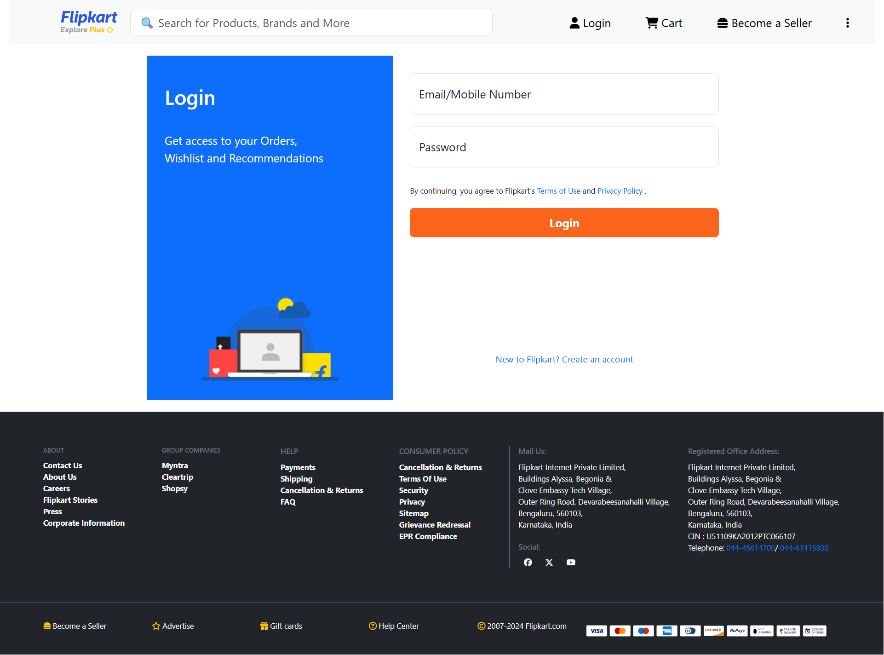
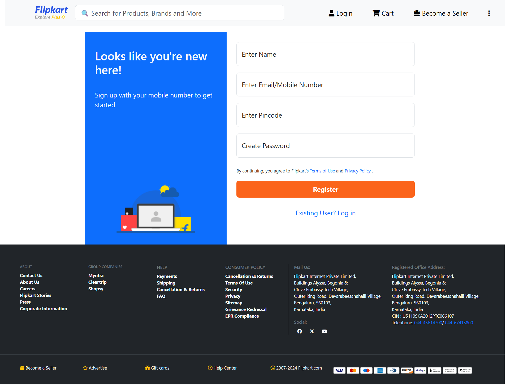

# 🛒 Flipkart Front-End Clone

A responsive and visually accurate front-end clone of Flipkart, built using **HTML**, **CSS**, **JavaScript**, and **Bootstrap**. This project replicates Flipkart’s homepage UI, product listings, and includes **login and signup pages** for user interaction (UI only – no backend).

---

## 🚀 Features

-  Fully responsive homepage and product listing page  
-  Bootstrap-powered layout with consistent UI design  
-  Navbar with search bar, dropdowns, and cart icon  
-  Interactive product cards with hover animations  
-  Carousel for promotional banners  
-  **Login and Signup pages** with validation-ready forms  
-  Reusable components (navbar, footer, product cards)

---

## 🛠️ Tech Stack

- **HTML5**
- **CSS3**
- **JavaScript**
- **Bootstrap 5**

---

## 📸 Screenshots

  
  

---

## 📂 Folder Structure

flipkart-clone/
├── index.html                 # Homepage
├── login.html                 # Login page
├── register.html              # Registration/Signup page

├── css/                       # CSS styles
│   ├── style.css              # Custom styles
│   └── bootstrap.css          # Bootstrap CSS

├── js/                        # JavaScript files
│   └── bootstrap.bundle.js    # Bootstrap JS (with Popper)

├── images/                    # Image assets (logos, banners, etc.)

├── screenshots/               # Screenshots for README
│   ├── homepage.png
│   ├── login.png
│   └── signup.png

└── README.md                  # Project documentation

    
---

## 📌 Future Improvements

-  Implement product detail and checkout pages
-  Enhance responsiveness for more devices

---

## 📄 License

-  This project is open-source and available for educational use.

---

## 🙌 Acknowledgements

-  Flipkart.com for UI reference
-  Bootstrap for layout and components
  
---
